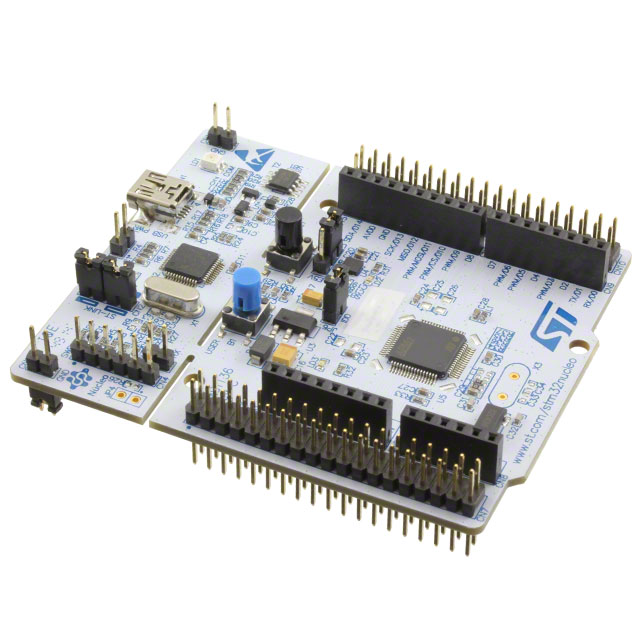

# Lab 3 Rapport

Naam: <!-- TODO: Voornaam Naam-->

## Schema

<!-- Plaats hier je schema i.p.v. de figuur van de Nucleo -->

## Resultaten

<!-- Beschrijf hier je resultaten. Neem de nodige foto's.-->